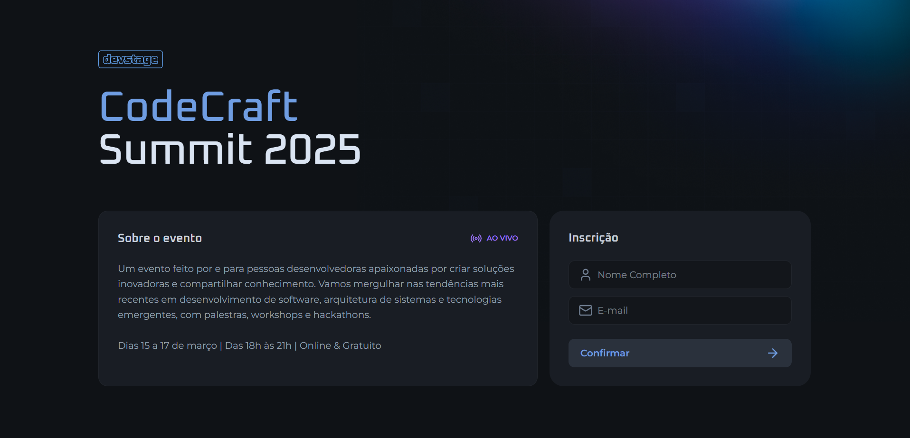

# 👨‍💻 NLW Connect - DevStage  

  

O **Next Level Week (NLW)** é um evento imersivo da **Rocketseat**, onde desenvolvedores aprimoram suas habilidades com trilhas práticas de aprendizado. Na edição **NLW Connect**, foi desenvolvido o **DevStage**, um software de indicação para eventos online.  

Este repositório contém a implementação das trilhas de **React** (Frontend) e **Node.js** (Backend). 🚀

## 🔥 Tecnologias utilizadas
- **Frontend**: Next.js, TypeScript, React, Lucide
- **Backend**: Node.js, Fastify, Zod, Swagger

## 📂 Estrutura do Projeto  
- `web/` → Código do frontend (React)
- `server/` → Código do backend (Node.js)

## 🚀 Como rodar o projeto

### 1️⃣ Clonar o repositório:
```bash
git clone https://github.com/AntoniofmBR/nlw-connect.git
cd nlw-connect
```

### 2️⃣ Rodar o backend:
```bash
cd server
npm install
npm run dev
```

### 3️⃣ Rodar o frontend:
```bash
cd ../website
npm install
npm run dev
```